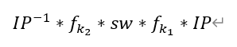
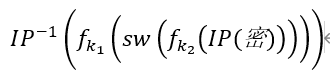
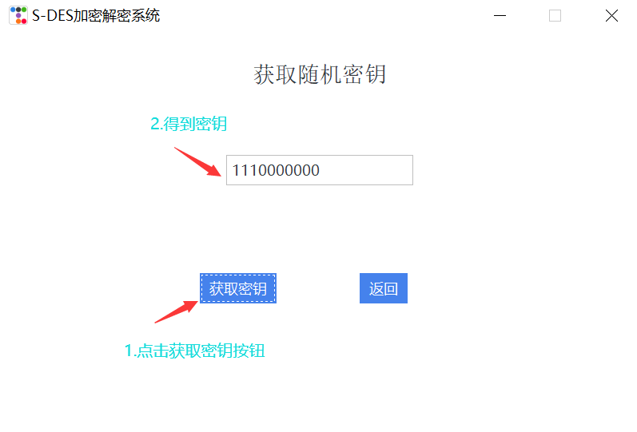
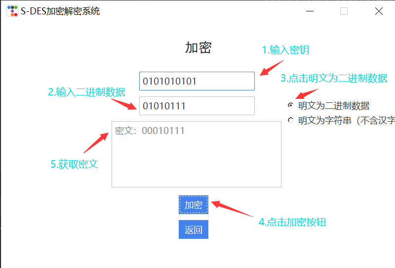
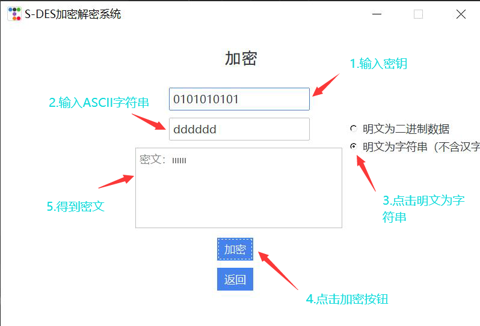
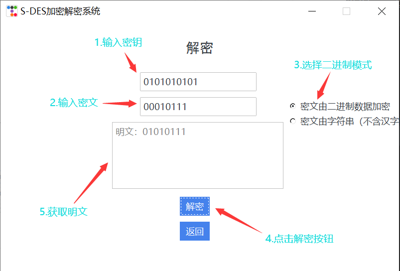
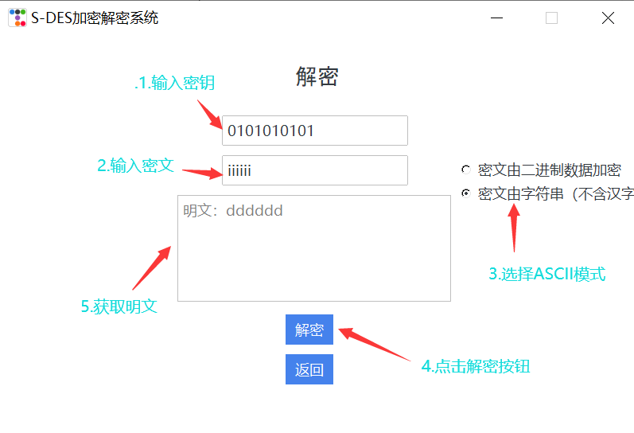
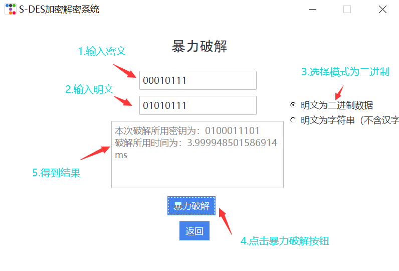
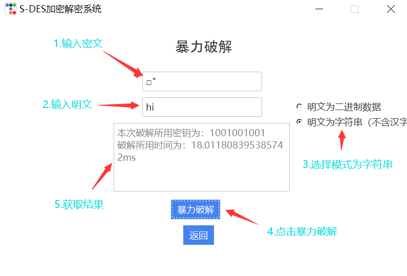

# encryption
## 作业详情
### 开发手册
#### 1.项目运行环境

本项目依赖以下环境：

- python 3.1.13
- 第三方库 ttkbootstrap, chardet
- windows 10 系统

#### 2.算法实现

##### 2.1生成密钥

创建密钥生成函数 首先获取随机10位密钥，再调用子密钥生成函数获取两个8bits子密钥。

    # 生成10位随机密钥
    def create_key(self) -> str:
       str_key = ""
       for i in range(10):
           key = random.randint(0, 1)
           str_key += str(key)
       return str(str_key)
    # 置换函数
    def permute(self, input_str, table) -> str:
       output_str = ""
       for bit_position in table:
           output_str += input_str[bit_position - 1]
       return output_str
    
    # 左移函数
    def lelf_move(self, key, n) -> list:
       # 将密钥分成两段并循环左移 n 位
       left_half = key[:5]
       right_half = key[5:]
       shifted_left = left_half[n:] + left_half[:n]
       shifted_right = right_half[n:] + right_half[:n]
       return shifted_left + shifted_right
    
    # 子密钥生成
    def child_key(self, k) -> tuple:
       # 执行 P10 置换
       p10_key = self.permute(k, self.P10)
       # 对结果进行左移操作和P8置换，得到 K1
       k1 = self.permute(self.lelf_move(p10_key, 1), self.P8)
       # 再次对上一步结果进行左移操作h和P8置换，得到 K2
       k2 = self.permute(self.lelf_move(self.lelf_move(p10_key, 1), 2), self.P8)
       return k1, k2

##### 2.2 加密函数

2.2.1 针对8bits数据的输入加密

    # 加密函数
    def encode(self, p, childk1, childk2) -> str:
       # 执行初始置换
       p = self.permute(p, self.Ip)
       l0 = p[:4]
       r0 = p[4:]
       l1 = r0
       # 第一轮的P4
       f_result = self.F_fuction(r0, childk1)
       # p41和L0异或,结果转换为4位二进制数（如果不足4位，左边会用0填充）
       r1 = f"{int(l0, 2) ^ int(f_result, 2):04b}"
       # 第二轮的P4
       f_result = self.F_fuction(r1, childk2)
       # p42和L1异或,结果转换为4位二进制数（如果不足4位，左边会用0填充）
       r2 = f"{int(l1, 2) ^ int(f_result, 2):04b}"
       # 逆置换并返回结果(左边R2右边R1)
       return self.permute(r2 + r1, self.Ip1)
    
    # f函数
    def F_fuction(self, right_half, k) -> str:
       # 对右半部分进行 E/P 扩展置换
       expanded = self.permute(right_half, self.EpBox)
       # 对结果与 K1 进行异或操作
       xored = '{0:08b}'.format(int(expanded, 2) ^ int(k, 2))
       # 将结果分为两组，并根据 S-box 进行替换
       s0_input = xored[:4]
       s1_input = xored[4:]
       # 根据S盒规则行列查找
       s0_row = int(s0_input[0] + s0_input[-1], 2)
       s0_col = int(s0_input[1:-1], 2)
       s1_row = int(s1_input[0] + s1_input[-1], 2)
       s1_col = int(s1_input[1:-1], 2)
       # 转换为2位二进制数
       s0_output = f"{self.Sbox1[s0_row][s0_col]:02b}"
       s1_output = f"{self.Sbox2[s1_row][s1_col]:02b}"
       # 对两个输出串进行 P4 置换得到最终结果
       s_output = s0_output + s1_output
       return self.permute(s_output, self.SPbox)

2.2.2	针对字符串的输入加密

通过函数将字符串中的每一位转化为8bits的二进制串，再进行分别独立的加密，最后变成一个加密后的二进制串的元组，每一位为8bits的二进制串。再通过函数将其转变为字符串。

      def bit_encode(self, s: str, rule: str = "utf-8") -> str:
       """
       将明文字符串按照rule的格式转化为01字符串
       s: 待编码字符串
       rule: 编码方案 默认utf-8
       return: 字符串对应01字符串
       """
       bytes_array = s.encode(rule)  # 首先将字符串s编码，返回一个bytes类型bytes_array
       bin_str_array = [bin(int(i))[2:].rjust(8, '0') for i in bytes_array]  # bytes_array转二进制字符串数组（每个byte8个bit）
       return ''.join(bin_str_array)  # 返回01字符串

    def group_by_8_bit(self, enter: str, is_bit_string: bool = False) -> list:
       """
       将输入的字符串转换为二进制形式，并8位为一组进行分割
       enter:要转换的字符串
       is_bit_string: 是否为bit字符串，如果是比特字符串，则填True，否则False
       return: 8倍整数的字符串数组
       """
       result = []
       bit_string = enter if is_bit_string else self.bit_encode(enter)
    
       for i in range(len(bit_string) // 8):
           result.append(bit_string[i * 8: i * 8 + 8])
    
       return result
    
    # 针对字符串的加密函数
    def str_encode(self, str_list, key) -> tuple:
       res_list = []
       p = str_list
       ch_key = self.child_key(key)
       for i in range(len(p)):
           c = self.encode(p[i], childk1=ch_key[0], childk2=ch_key[1])
           res_list.append(c)
       return res_list, ch_key  # 返回本次加密的密文数组以及加密所用的子密钥
    # 将二进制的字符串数组变成输入的明文字符串
    def str_to_word(self, p_list):
       temp_str = ""
       for i in range(len(p_list)):
           temp_str += p_list[i]
       ascii_string = ''.join(chr(int(temp_str[i:i + 8], 2)) for i in range(0, len(temp_str), 8))
       return ascii_string

##### 2.3 解密函数

2.3.1 针对8bits数据的输入解密

    # 解密函数
    def decode(self, c, childk1, childk2) -> str:
       # 执行初始置换
       c = self.permute(c, self.Ip)
       r2 = c[:4]
       l2 = c[4:]
       # 第一轮的P4
       f_result = self.F_fuction(l2, childk2)
       # p41和R2异或,结果转换为4位二进制数（如果不足4位，左边会用0填充）
       l1 = f"{int(r2, 2) ^ int(f_result, 2):04b}"
       # 第二轮的P4
       f_result = self.F_fuction(l1, childk1)
       # p42和R1异或,结果转换为4位二进制数（如果不足4位，左边会用0填充）
       r1 = f'{int(l2, 2) ^ int(f_result, 2):04b}'
       # 逆置换并返回明文
       return self.permute(r1 + l1, self.Ip1)
    
    # f函数
    def F_fuction(self, right_half, k) -> str:
       # 对右半部分进行 E/P 扩展置换
       expanded = self.permute(right_half, self.EpBox)
       # 对结果与 K1 进行异或操作
       xored = '{0:08b}'.format(int(expanded, 2) ^ int(k, 2))
       # 将结果分为两组，并根据 S-box 进行替换
       s0_input = xored[:4]
       s1_input = xored[4:]
       # 根据S盒规则行列查找
       s0_row = int(s0_input[0] + s0_input[-1], 2)
       s0_col = int(s0_input[1:-1], 2)
       s1_row = int(s1_input[0] + s1_input[-1], 2)
       s1_col = int(s1_input[1:-1], 2)
       # 转换为2位二进制数
       s0_output = f"{self.Sbox1[s0_row][s0_col]:02b}"
       s1_output = f"{self.Sbox2[s1_row][s1_col]:02b}"
       # 对两个输出串进行 P4 置换得到最终结果
       s_output = s0_output + s1_output
       return self.permute(s_output, self.SPbox)

2.3.2 针对字符串的输入解密
通过函数将字符串中的每一位转化为8bits的二进制串，再进行分别独立的解密，最后变成一个解密后的二进制串的元组，每一位为8bits的二进制串。再通过函数将其转变为字符串。

    def bit_encode(self, s: str, rule: str = "utf-8") -> str:
       """
       将明文字符串按照rule的格式转化为01字符串
       s: 待编码字符串
       rule: 编码方案 默认utf-8
       return: 字符串对应01字符串
       """
       bytes_array = s.encode(rule)  # 首先将字符串s编码，返回一个bytes类型bytes_array
       bin_str_array = [bin(int(i))[2:].rjust(8, '0') for i in bytes_array]  # bytes_array转二进制字符串数组（每个byte8个bit）
       return ''.join(bin_str_array)  # 返回01字符串
    
    def group_by_8_bit(self, enter: str, is_bit_string: bool = False) -> list:
       """
       将输入的字符串转换为二进制形式，并8位为一组进行分割
       enter:要转换的字符串
       is_bit_string: 是否为bit字符串，如果是比特字符串，则填True，否则False
       return: 8倍整数的字符串数组
       """
       result = []
       bit_string = enter if is_bit_string else self.bit_encode(enter)
    
       for i in range(len(bit_string) // 8):
           result.append(bit_string[i * 8: i * 8 + 8])
    
       return result

##### 2.4 暴力破解函数

 我们已经获悉了明文和密文，现在从0遍历10位密钥，不断尝试，直到获取到正确的密钥。

2.4.1 针对8bits的破解

    # 暴力破解密钥
    def brute_force(self, p_list, c_list) -> tuple:
       start_time = time.time()  # 获取当前时间
       for i in range(0, 1024):  # 1024是因为2^10=1024，即10位二进制数的最大值
           binary_str = bin(i)[2:].zfill(10)  # bin函数返回的字符串形式的二进制数，去掉前缀'0b'，然后用zfill函数补足10位
           key = self.child_key(k=binary_str)
           c = self.encode(p_list, childk1=key[0], childk2=key[1])
           if c == c_list:
               end_time = time.time()
               execution_time = end_time - start_time  # 计算两个时间点之间的差异
               return binary_str, str(execution_time*1000)

2.4.2 针对字符串的破解

    def str_brute_force(self, p, c):
       start_time = time.time()  # 获取当前时间
       p_list = self.group_by_8_bit(p)
       for i in range(0, 1024):  # 1024是因为2^10=1024，即10位二进制数的最大值
           binary_str = bin(i)[2:].zfill(10)  # bin函数返回的字符串形式的二进制数，去掉前缀'0b'，然后用zfill函数补足10位
           temp = self.str_encode(p_list, binary_str)
           str_temp = ""
           for i in range(len(temp[0])):
               str_temp += temp[0][i]
           if str_temp == c:
               end_time = time.time()
               execution_time = end_time - start_time  # 计算两个时间点之间的差异
               return binary_str, str(execution_time * 1000)

#### 3.gui实现

##### 3.1 总体界面

3.1.1 页面容器

    page = ttk.Window()
    page.geometry('600x400+900+450')
    # 窗口名称
    page.title('S-DES加密解密系统')
    # 禁止调节窗口大小
    page.resizable(False, False)
    MainPage(page)
    page.mainloop()

3.1.2 页面初始化

    def __init__(self, master_page):
        self.page = None
        self.root = master_page
        self.root.geometry(page_size)
        self.plain_text = ttk.StringVar()
        self.secret_key = ttk.StringVar()
        self.selected_default = ttk.IntVar()
        self.init_page()

##### 3.2 页面参数设置(以加密页面为例)

3.2.1 页面初始化

    def __init__(self, master_page):
        self.page = None
        self.root = master_page
        self.root.geometry(page_size)
        self.plain_text = ttk.StringVar()
        self.secret_key = ttk.StringVar()
        self.selected_default = ttk.IntVar()
        self.init_page()

3.2.2 标签（label）

    # 标题
    title_label = tk.Label(self.page, text='加密', height=3, width=200, bg='white',
                            font=('Arial', 14))
    title_label.pack()

3.2.3 按钮（Button）

    # 加密按钮
    encrypt_button = ttk.Button(self.page, text='加密', style='raised',
                                command=encrypt)
    encrypt_button.pack(padx=100, ipady=100, pady=10)
    encrypt_button.place(relx=0.45, rely=0.7)

3.2.4 输入框（Entry）
    
    # 明文输入
    plain_text_input = ttk.Entry(self.page, textvariable=self.plain_text)
    plain_text_input.insert('insert', '请在此输入明文')
    plain_text_input.bind('<Button-1>', plain_fun)
    plain_text_input.pack(padx=100, ipady=100, pady=10)
    plain_text_input.place(relx=0.35, rely=0.3)

3.2.5 输出框（Text）

    # 密文输出
    secret_text_output = ttk.Text(self.page, height=5, width=30)
    secret_text_output.place(relx=0.28, rely=0.4)
    secret_text_output.insert('insert', '密文：')
    secret_text_output['fg'] = 'grey'

3.2.6 模式选择（Radiobutton）

    # 模式选择
    options = ["明文为二进制数据", "明文为字符串（不含汉字）"]
    radiobutton_vars = []
    for option in options:
        radiobutton_vars.append(tk.StringVar())
    self.selected_default.set(2)
    for i in range(len(options)):
        radiobutton = tk.Radiobutton(self.page, text=options[i], value=i + 1, variable=self.selected_default)
        radiobutton.place(relx=0.72, rely=(0.3 + 0.06 * i))

##### 3.3 各功能实现函数

3.3.1 输入框提示（输入为空时出现提示，开始输入后清空提示）

    # 实现输入框默认提示
    def key_fun(event):
        if self.secret_key.get() == '请在此输入密钥':
            secret_key_input.delete('0', 'end')
        if self.plain_text.get() == '':
            plain_text_input.insert('insert', '请在此输入明文')

    def plain_fun(event):
        if self.plain_text.get() == '请在此输入明文':
            plain_text_input.delete('0', 'end')
        if self.secret_key.get() == '':
            secret_key_input.insert('insert', '请在此输入密钥')

3.3.2 获取密钥

    # 实现随机密钥获取
    def get_secret():
        key = DesEncode.DesCode().create_key()
        secret_show.delete(0.0, tk.END)
        secret_show.insert('insert', key)

3.3.3 加密

    # 实现加密操作
    def encrypt():
        secret_text_output.delete('0.0', 'end')  # 清空密文显示框
        key = self.secret_key.get()  # 从密钥输入框获取密钥
        if len(key) != 10:
            tk.messagebox.showerror('err', '密钥长度有误，请检查')
            return -1
        if not key.isdigit():
            tk.messagebox.showerror('err', '密钥含有非二进制字符，请检查')
            return -1
        for i in range(len(key)):
            if int(key[i]) not in [0, 1]:
                tk.messagebox.showerror('err', '密钥含有非二进制字符,请重新输入')
                return -1
        plain = self.plain_text.get()  # 从明文输入框获取明文
        if DesEncode.DesCode().is_chinese(plain):  # 处理二进制数据
            tk.messagebox.showerror('err', '明文含有汉字,请重新输入')
        else:
            if self.selected_default.get() == 1:
                if len(plain) != 8:
                    tk.messagebox.showerror('err', '明文长度有误，请检查')
                    return -1
                for i in range(len(plain)):
                    if plain[i] not in ['0', '1']:
                        tk.messagebox.showerror('err', '明文含有非二进制字符,请重新输入')
                        return -1
                keys = DesEncode.DesCode().child_key(key)
                secret_text = DesEncode.DesCode().encode(plain, keys[0], keys[1])
                secret_text_output.insert('insert', '密文：' + secret_text)
            if self.selected_default.get() == 2:  # 处理ASCII字符串数据
                plain = DesEncode.DesCode().group_by_8_bit(plain)
                secret_text_tuple = DesEncode.DesCode().str_encode(plain, key)
                secret_text = DesEncode.DesCode().str_to_word(secret_text_tuple[0])
                secret_text_output.insert('insert', '密文：' + secret_text)

3.3.4 解密

    # 实现解密操作
    def decrypt():
        decrypt_text_output.delete('0.0', 'end')
        key = self.secret_key.get()  # 从密钥输入框获取密钥
        if len(key) != 10:
            tk.messagebox.showerror('err', '密钥长度有误，请检查')
            return -1
        if not key.isdigit():
            tk.messagebox.showerror('err', '密钥含有非二进制字符，请检查')
            return -1
        for i in range(len(key)):
            if int(key[i]) not in [0, 1]:
                tk.messagebox.showerror('err', '密钥含有非二进制字符,请重新输入')
                return -1
        secret_text = self.secret_text.get()# 从密文输入框获取密文
        if self.selected_default.get() == 1:  # 处理二进制数据
            for i in range(len(secret_text)):
                if secret_text[i] not in ['0', '1']:
                    tk.messagebox.showerror('err', '密文含有非二进制字符,请重新输入')
                    return -1
            if len(secret_text) != 8:
                tk.messagebox.showerror('err', '密文长度有误，请检查')
                return -1
            for i in range(len(secret_text)):
                if secret_text[i] not in ['0', '1']:
                    tk.messagebox.showerror('err', '密文含有非二进制字符,请重新输入')
                    return -1
            keys = DesEncode.DesCode().child_key(key)
            plain_text = DesEncode.DesCode().decode(secret_text, keys[0], keys[1])
            decrypt_text_output.insert('insert', '明文：' + plain_text)
        if self.selected_default.get() == 2:  # 处理ASCII字符串数据
            secret_text = DesEncode.DesCode().group_by_8_bit(secret_text)
            secret_text = DesEncode.DesCode().add_str(secret_text)
            plain_text_tuple = DesEncode.DesCode().str_decode(secret_text, key)
            plain_text = DesEncode.DesCode().str_to_word(plain_text_tuple)
            decrypt_text_output.insert('insert', '明文：' + plain_text)

3.3.5 暴力破解

    # 实现暴力破解操作
    def decrypt():
        decrypt_text_output.delete('0.0', 'end')
        plain_text = self.plain_text.get()# 从明文输入框获取明文
        secret_text = self.secret_text.get()# 从密文输入框获取密文
        if self.selected_default.get() == 1:  # 处理二进制数据
            for i in range(len(secret_text)):
                if secret_text[i] not in ['0', '1']:
                    tk.messagebox.showerror('err', '密文含有非二进制字符,请重新输入')
                    return -1
            for i in range(len(plain_text)):
                if plain_text[i] not in ['0', '1']:
                    tk.messagebox.showerror('err', '明文含有非二进制字符,请重新输入')
                    return -1
            if len(plain_text) != 8:
                tk.messagebox.showerror('err', '明文长度有误，请检查')
                return -1
            if len(secret_text) != 8:
                tk.messagebox.showerror('err', '密文长度有误，请检查')
                return -1
            decrypted = DesEncode.DesCode().brute_force(plain_text, secret_text)
            if (decrypted == None):
                print("返回为空")
            else:
                decrypt_text_output.insert('insert',
                                           '本次破解所用密钥为：' + decrypted[0] + '\n破解所用时间为：' +
                                           decrypted[1] + 'ms')
        if self.selected_default.get() == 2:  # 处理ASCII字符串数据
            secret_text = DesEncode.DesCode().group_by_8_bit(secret_text)
            secret_text = DesEncode.DesCode().add_str(secret_text)
            decrypted = DesEncode.DesCode().str_brute_force(plain_text, secret_text)
            if (decrypted == None):
                print("返回为空")
            else:
                decrypt_text_output.insert('insert',
                                           '本次破解所用密钥为：' + decrypted[0] + '\n破解所用时间为：' +
                                           decrypted[1] + 'ms')

    

### 用户指南
#### 1.概述

1.1 项目介绍

本项目名为S-DES加密解密系统。采用轻量级的对称加密算法 S-DES（Simplified Data Encryption Standard），能够对数据的安全进行一定的保护。该算法由美国圣克拉拉大学的Edward Schaefer教授于1996年提出，适用于教育用途。

1.2 用户指南概览

本用户指南将帮助您了解如何本项目的数学原理和使用流程。

#### 2.数学基础

2.1 本项目的运行原理

本项目采用S-DES算法，明文分组为8位，主密钥分组为10位，采用两轮选代。

2.3 密钥生成

利用随机种子随机生成一个10bit密钥

2.2 加密和解密

加密算法的数学表示：

解密算法的数学表示：

2.4 暴力破解

遍历所有密钥，直到找到符合要求的密钥

#### 3.使用流程

3.1 准备密钥

首先，您需要一个密钥，可通过以下方式获取：

-   自行准备一个有效的S-DES密钥（10bit）。

-   通过获取密钥功能获取一个随机密钥

3.2 示例：加密二进制数据

3.3 示例：加密ASCII字符串数据

3.4 示例：解密二进制数据

3.5 示例：解密ASCII字符串数据

3.6 示例：暴力破解二进制数据

3.6 示例：暴力破解ASCII字符串数据

#### 4.注意事项

本项目使用的S-DES算法反破译能力极弱，仅作为学习使用，不建议运用于实际生活中，尤其对于个人或工作的敏感数据。

### 测试结果
#### 第一关：基本测试
#### 第二关：交叉测试
#### 第三关：拓展功能
#### 第四关：暴力破解
#### 第五关：封闭测试
